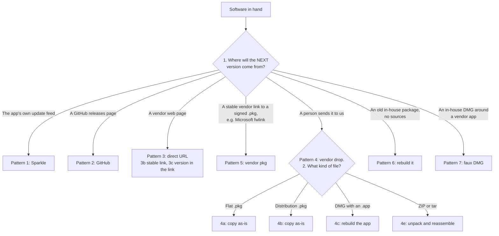
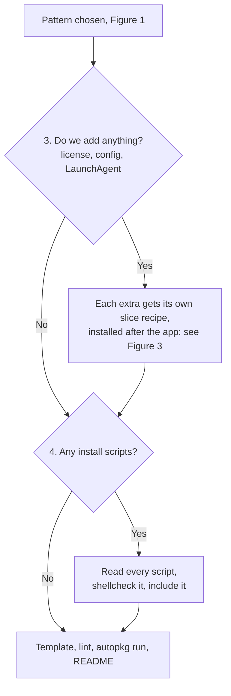
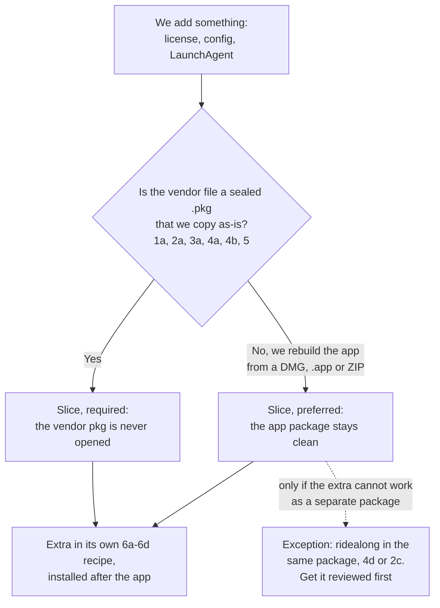

# Build a recipe from a package — a walkthrough

**Who this is for:** you know Unix and your way around a Mac, but you're not a Mac
admin, and someone has just handed you some software and said *"build a recipe."*
This page takes you from "what is this file?" to a recipe that lints clean, builds,
and is ready for review. You don't need to read anything else first. Where a detail
lives elsewhere, the link is there for when you want it.

**What you'll produce:** a folder `recipes/<Vendor>/<App>/` in your customer's recipe
repo, containing:

| File | What it is |
|---|---|
| `<App>.download.recipe.yaml` | Gets the software and checks its code signature |
| `<App>.pkg.recipe.yaml` | Turns it into the package we deploy |
| `README.md` | What you found and decided, for the next person |

> **Prefer to be walked through it?** Ask your coding agent to use the
> [`first-recipe-interview`](../.devagent/skills/first-recipe-interview.md) skill. It
> follows this page one question at a time, runs the inspection commands for you, and
> asks you to confirm what they found.

Examples below use the kit's example customer, **Acme Fruit Co.**
([`customer/acme/`](../customer/acme/README.md)). Their recipe repo is
`customer/acme/output`, and their packages are named `Acme_<App>.pkg`. Substitute
your own customer.

---

## The map

Four questions, in this order. Each answer narrows the **pattern**, the kit's name for
a recipe shape ([`patterns.md`](patterns.md)), and the pattern tells you which
template or example to start from.

1. **Where did it come from?** (Step 1)
2. **What kind of file is it?** (Step 2)
3. **Do we add anything of our own?** (Step 3)
4. **Are there install scripts?** (Step 4)

Three small charts go with them:

| Figure | Answers | Where |
|---|---|---|
| 1 | Questions 1 and 2: which pattern? | [Step 1](#step-1--where-did-it-come-from) |
| 2 | Questions 3 and 4: what goes in which package? | [Step 3](#step-3--do-we-add-anything-of-our-own) |
| 3 | Detail of question 3: must the extra be a slice? | [Slice by default](#slice-by-default) |

The rest of this page walks through each question: what to run, what to look for, and
what the answer means.

---

## Step 0 — Set up

```bash
cd /path/to/house-special
bin/recipe-linter.sh --repo customer/acme/output --pair-check   # should pass before you touch anything
mkdir -p customer/acme/input/<App> && cp ~/Downloads/<the file> customer/acme/input/<App>/
```

- You need **AutoPkg** installed. The kit's Python tools use AutoPkg's own Python
  ([getting-started](getting-started.md)).
- You also need **[Suspicious Package](https://www.mothersruin.com/software/SuspiciousPackage/)** and
  **[Apparency](https://www.mothersruin.com/software/Apparency/)**, from Mothers Ruin Software.
  They're the second opinion on everything the kit's scripts tell you (see Step 2).
- `customer/<name>/input/` is where raw vendor files go. It's **gitignored**: vendor
  installers never go into git.
- Keep notes as you go. They become the recipe's `README.md` at the end.

**Check for prior art first.** Someone may have packaged this already:
- **In your own repo:** `ls customer/acme/output/recipes/*/ | grep -i <App>`. If a
  recipe exists, the job may be a fix, not a new recipe
  ([updating-existing-recipes.md](updating-existing-recipes.md)).
- **In the AutoPkg community:** `autopkg search <App>`. A community recipe that passes
  the audit in [Standards §6.10.2](../reference/recipe-standards.md) (it downloads from
  the vendor, checks the signature, has no hidden payload) can be adopted rather than
  written from scratch.
- **An old package** your org deployed before: ask for it. Expanding it shows every
  file, owner and script it installed, which answers most of Steps 3 and 4.

## Step 1 — Where did it come from?

This is the most important question, and it's about **how we'll get the next
version**, not this one.



*Figure 1. Which pattern? Only vendor drops need question 2 to pick a letter; for the
others, Step 2 is about the signature. Whichever pattern you land on, continue with
[Figure 2](#step-3--do-we-add-anything-of-our-own).*

| You got it… | How to confirm | Pattern |
|---|---|---|
| From inside the app's own updater | Open the `.app`, then `defaults read "/path/App.app/Contents/Info.plist" SUFeedURL`. A URL means Sparkle. | **1** |
| From a project's GitHub **Releases** page | The download link is `github.com/<owner>/<repo>/releases/…` | **2** |
| From a vendor web page | Download it twice a week apart, or look at the link: does the URL stay the same (`…/latest`, `fwlink/?linkid=…`)? | **3b** (same URL) or **3c** (URL has a version in it; we'll search the page for it) |
| A signed `.pkg` from a stable vendor link | Common with Microsoft | **5** |
| Emailed, on a share, behind a login, or "the vendor sent us this" | There is no link a machine can fetch | **4** (vendor drop) |
| An **in-house** package that's been deployed for years, sources lost | Nobody can rebuild it from scratch | **6** (rebuilt) |
| An in-house **DMG** someone made around a vendor app | Often made with a snapshot tool like Jamf Composer | **7** (faux vendor DMG) |

Not sure between "vendor" and "in-house" for a `.pkg`? The kit can tell you:

```bash
bin/analyze-package.sh customer/acme/input/<App>/<file>.pkg --customer acme
```

It reports **Origin** (vendor-originated / custom-build), **Confidence** and a
suggested pattern, with the reasons. See [package-analysis.md](package-analysis.md).

> **Rule of thumb:** if a machine can download it without a human, use 1, 2, 3 or 5.
> Those recipes update themselves. Vendor drops (4) and rebuilds (6, 7) need a person
> each time there's a new version.

## Step 2 — What kind of file is it?

Look before you assume: file names lie.

```bash
file customer/acme/input/<App>/*            # what is it really?
```

| File | Look inside with | What decides the letter |
|---|---|---|
| **`.pkg`** | `pkgutil --expand <file>.pkg /tmp/x && ls /tmp/x` | A `Distribution` file at the top → **distribution** package (**4b**). Just `PackageInfo`, `Bom`, `Payload` → **component** package (**4a**). A *folder* named `.pkg` → an old bundle package (treat as 4a and say so in the README). |
| **`.dmg`** | `bin/inspect-dmg.sh <file>.dmg` | Lists the `.app`s inside with their version and bundle ID. An `.app` → rebuild (**4c**, **2b**, **3b**). A `.pkg` inside the DMG → the package is the real artifact. |
| **`.zip` / `.tar.gz`** | `bin/inspect-archive.sh <file>` | What's at the top level: an `.app`, a `.pkg`, or loose files to reassemble (**4e**, **2d**). |
| **`.app`** (bare) | `bin/inspect-app.sh <App>.app` | Version, bundle ID, architectures, whether it's signed. |

> **Get a second opinion.** Two excellent apps from Mothers Ruin Software show the
> same facts in a GUI, independently of our scripts:
> [**Suspicious Package**](https://www.mothersruin.com/software/SuspiciousPackage/)
> opens a `.pkg` without installing it: files, scripts, signature, notarization.
> [**Apparency**](https://www.mothersruin.com/software/Apparency/) does the same for an
> `.app`: signature, Team ID, notarization, Gatekeeper status, entitlements, what's in
> the bundle. Open the file in one of them and check it agrees with what the
> commands below report. If they disagree, trust neither until you know why.

**Now check the code signature.** Every recipe must verify what it downloads, and you
need the exact values for the recipe:

```bash
pkgutil --check-signature <file>.pkg        # for .pkg — NOT codesign (lesson 5)
codesign -dvv  "/path/App.app" 2>&1 | grep -E 'Authority|TeamIdentifier'
codesign -dr - "/path/App.app"              # the "designated requirement" — copy it verbatim
```

| Result | What to do |
|---|---|
| Developer ID with a Team ID | Paste the requirement (`.app`) or the three `expected_authority_names` lines (`.pkg`) into the download recipe **exactly**. The requirement pins the Team ID (`subject.OU`). Write the Team ID in the README too |
| Ad-hoc signed (`Signature=adhoc`, no Team ID) | Verify with an identifier-only requirement, and add `teamid: "UNSIGNED_NO_TEAMID"` to the download recipe's `Input` with a comment saying why. Flag it for review; see the [Fruit screensaver](../customer/acme/output/recipes/Corkscrews/Fruit-Screensaver/README.md) |
| Not signed at all | `NO_CODE_SIGNATURE_REQUIRED: true` in the recipe's `Input`, and **say why** in the README. Check for a signed `.app` *inside* first (lesson 16). |

## Step 3 — Do we add anything of our own?



*Figure 2. What goes in which package? The "yes" branch is expanded in
[Figure 3](#slice-by-default); question 4 is [Step 4](#step-4--are-there-install-scripts).*

Vendors ship the app. Organizations often add things around it. Look for:

- a **license file** or serial number file (often somewhere like `/Library/Application Support/<Vendor>/`
  or `/Users/Shared/<Vendor>/`);
- a **customized config** or preferences file;
- a **LaunchAgent / LaunchDaemon** (`/Library/LaunchAgents/*.plist`) that starts
  something at login or boot;
- helper scripts, uninstallers, desktop shortcuts.

**How to find them:** ask whoever gave you the software ("does anything else go with
this?"). If you're replacing an existing package, list what it installs:

```bash
pkgutil --expand old.pkg /tmp/old && lsbom -s /tmp/old/Bom | cut -c1-120
```

Everything that isn't the vendor's `.app` is an org addition.

### Slice by default

Then decide **where the extra goes**. The answer is almost always: **its own
recipe, a slice.**



*Figure 3. Must the extra be a slice? Back to [Figure 2](#step-3--do-we-add-anything-of-our-own) for install scripts.*

> **Slice by default.** The vendor's app gets one recipe and one package, clean and
> exactly as the vendor shipped it. Each thing we add (a license file, a config file, a
> LaunchAgent) gets its own small recipe whose package installs *after* the app's.
>
> - **Required** when the vendor's artifact is a sealed, signed `.pkg` we deploy as-is
>   (Patterns 1a, 2a, 3a, 4a, 4b, 5, or a vendor `.pkg` found inside a DMG or ZIP). A
>   sealed package is never opened: rebuilding it would throw away the vendor's
>   signature and make it ours.
> - **Preferred** even when we rebuild the app ourselves (a DMG, `.app` or ZIP holding
>   just the app). A slice that drops a license file into place is far simpler than
>   cutting open the app package, sliding the file in and re-sealing it every time the
>   app updates.

What the slice looks like depends on what it installs:

| The extra | Slice recipe | Example |
|---|---|---|
| A license or config file | **6c**: one file, exact owner and mode | [Orchard Analytics license](../customer/acme/output/recipes/OrchardLabs/Orchard-Analytics-License/README.md) |
| Several files / a folder of settings | **6a** or **6b** (with a script) | — |
| A LaunchAgent or LaunchDaemon (plus a script to load it) | **6d** if it's only a script, **6b** if it installs the plist too | — |

Why slices win:
- **Independent updates.** The app updates monthly; the license changes yearly.
  Neither has to be rebuilt for the other.
- **Independent owners and rollback.** IT owns the license; the vendor owns the app.
  Either can be rolled back alone.
- **Different origins.** The app can come from the vendor's site (automated,
  signature-checked) while the license is a vendor-drop file only IT has.
- **Install-volume rules.** Recent macOS releases reject flat packages that write to
  both `/Applications` and user-data locations (`/Users/Shared`), so those extras must
  be separate anyway (methodology lesson 19).

**Install order.** A slice installs *after* the package that creates the folder it
writes into, usually the app. Say so in the slice's README (**Install after:**
`Acme_<App>.pkg`). Extras normally live **outside the app bundle**, e.g.
`/Library/Application Support/<Vendor>/`. Rarely, a vendor insists on a file *inside*
the bundle (`/Applications/<App>.app/Contents/Resources/…`). If you hit that:
- the slice can only install after the app, because that folder doesn't exist before;
- every app update replaces the bundle and **deletes** the file, so the slice has to run
  again after each app update, not just once;
- adding a file to a signed app breaks its code signature.

**The exception, a ridealong in the same package** (Patterns 2c, 4d, 4e when rebuilt),
is only for an extra that genuinely can't work as a separate package, for example
when the vendor's own installer logic needs it *during* the app's install. If you
think you have that case, say so in your plan and get it reviewed first.

Slicing in depth, with the decision sketch and the slice-pattern table:
[Standards §6.10.1](../reference/recipe-standards.md). Methodology lesson 21 is a
real case of an in-house wrapper split into four slices.

**Never commit secrets.** A license key file goes in the vendor cache (gitignored),
not in the recipe folder. The recipe refers to it by path.

> **Before you write a script for the Dock, the desktop picture, the default browser or
> "run this at every login":** small, trusted, signed tools already do these properly
> (dockutil, desktoppr, default-browser, Outset). See
> [community-tools.md](community-tools.md). The kit has recipes for all of them.

## Step 4 — Are there install scripts?

Packages can run `preinstall` / `postinstall` scripts as **root**. If yours has them,
or you need one (e.g. to load that LaunchAgent), you own them now.

```bash
pkgutil --expand <file>.pkg /tmp/x && ls -l /tmp/x/Scripts /tmp/x/*.pkg/Scripts 2>/dev/null
```

For every script:

1. **Read it, all of it.** What does it change? Does it hard-code a version
   (`/Applications/App 22.0/…` when the app is now 26.0)? A user name? A server? A
   path that no longer exists? (Methodology lesson 20: these break silently.)
2. **Does it act on a user?** Scripts run as root. Anything per-user (preferences, files
   in `~`) must be done *as* that user, and there may be nobody logged in. Use the
   [postinstall-as-user](../.devagent/skills/postinstall-as-user.md) pattern. Worked
   examples: [Fruit screensaver default](../customer/acme/output/recipes/Corkscrews/Fruit-Screensaver-Default/README.md) (a config slice),
   [Fruta starter kit](../customer/acme/output/recipes/AcmeFruitCo/Fruta-Starter-Kit/README.md).
3. **Lint it:** `shellcheck -S warning postinstall`. It must run under stock
   `/bin/bash` 3.2, and `bash -n postinstall` must pass.
4. **Make it idempotent and safe:** running it twice is fine; it exits 0 on "nothing
   to do"; it acts only when `$3` is `/` (the running system).
5. Include it: put it in a `scripts/` folder next to the recipe (executable:
   `chmod 755`) and add `scripts: "%RECIPE_DIR%/scripts"` to the pkg recipe's
   `pkg_request`.

## Step 5 — Write the recipe

You now have a pattern. Start from the closest working thing:

| Pattern | Start from |
|---|---|
| 2b GitHub DMG | [`customer/acme/…/Moonlight`](../customer/acme/output/recipes/MoonlightGameStreaming/Moonlight/README.md) — the canonical drag-to-Applications DMG |
| 2b GitHub archive (not a DMG) | [`…/Fruit-Screensaver`](../customer/acme/output/recipes/Corkscrews/Fruit-Screensaver/README.md): a `.tar.gz` unpacked with `Unarchiver` |
| A config or behaviour slice (6b) | [`…/Fruit-Screensaver-Default`](../customer/acme/output/recipes/Corkscrews/Fruit-Screensaver-Default/README.md): makes the screensaver the default, as a separate package |
| 2d GitHub source ZIP | [`…/Fruta-Starter-Kit`](../customer/acme/output/recipes/AcmeFruitCo/Fruta-Starter-Kit/README.md) |
| 3c scraped page | [`…/Orange-Data-Mining`](../customer/acme/output/recipes/Biolab/Orange-Data-Mining/README.md) |
| 4a, 4b, 4c, 4d | [`templates/pattern-4-vendor-drop`](../templates/pattern-4-vendor-drop/), [`pattern-4b-…`](../templates/pattern-4b-distribution-package/), [`pattern-4c-…`](../templates/pattern-4c-vendor-drop-dmg/), [`pattern-4d-…`](../templates/pattern-4d-vendor-drop-dmg-ridealong/) |
| 5 | [`templates/pattern-5-vendor-pkg-url`](../templates/pattern-5-vendor-pkg-url/) |
| 6, 6b, 6c, 6d | Generate it: `sudo bin/pkg-reverse.sh <old.pkg> --dest <vendor-cache>/<Vendor>`, then `bin/blueprint-to-recipe.sh --blueprint <…>/blueprint.conf --out <recipe-dir>`. Compare with [`templates/pattern-6*`](../templates/README.md) |
| 7 | [`templates/pattern-7-faux-vendor-dmg`](../templates/pattern-7-faux-vendor-dmg/) |

Copy it into `customer/acme/output/recipes/<Vendor>/<App>/` and fill it in. The things
people most often get wrong:

- **Names:** folder, file names and `NAME` all match, with hyphens, no dots or spaces
  (`Raspberry-Pi-Imager`). Identifiers are `com.acmefruit.autopkg.download.<App>` and
  `com.acmefruit.autopkg.pkg.<App>`. The prefix comes from [`config/org.yaml`](../config/org.yaml).
- **Package name:** `Acme_%NAME%` **only if PkgCreator builds it**. A vendor `.pkg` you
  copy as-is keeps the vendor's name. Never use `AppPkgCreator`.
- **Version:** from the app (`Versioner`) or the release (GitHub). Vendor drops pin it
  in the download recipe's `Input` (`version: "1.2.3"`).
- **The signature values** from Step 2, pasted exactly.
- **`Comment:`** starts with the pattern, e.g. `Comment: Pattern 4d — …`.
- **Ownership:** in the pkg recipe's `chown` list, record the **stock macOS owner** for
  shared folders like `Library` (owner only, no `mode`), then your own paths. Why:
  [package-ownership.md](package-ownership.md).

Leftover `REPLACE_…` placeholders?

```bash
bin/scan-placeholders.sh --repo customer/acme/output <App>
```

## Step 6 — Check it, then run it for real

```bash
bin/recipe-linter.sh --repo customer/acme/output --pair-check          # rules: naming, signing, structure
bin/autopkg-preflight.py --repo customer/acme/output --app customer/acme/output/recipes/<Vendor>/<App>   # runtime-bug checks
autopkg run -v --search-dir customer/acme/output/recipes \
  customer/acme/output/recipes/<Vendor>/<App>/<App>.pkg.recipe.yaml   # the real thing
```

- **Lint clean is not "works".** Every bug in [methodology.md](../reference/methodology.md)
  passed review first. Only a real `autopkg run` proves a recipe.
- The built package lands in `~/Library/AutoPkg/Cache/com.acmefruit.autopkg.pkg.<App>/`.
- A fix doesn't seem to take effect? Clear the cache and rerun:
  `bin/clear-autopkg-cache.sh com.acmefruit.autopkg.pkg.<App>`.
- Look at what you built: `pkgutil --expand <built>.pkg /tmp/b && lsbom -p MUGf /tmp/b/Bom | head -30`.

### Optional: check it against what came before

If you have something to compare against, an old package or just the vendor's own
download, this catches the mistakes lint and a successful run can't: the wrong
vendor, a missing license file, or a version your Macs can't run. It's optional, but
if you skip it, say so in the README. The full method, with every command, is the
**equivalence audit** in [Standards §6.10.2](../reference/recipe-standards.md).

| Check | Must match | Allowed to differ | Stop and ask |
|---|---|---|---|
| **Signature** | Same Team ID | Nothing | Any difference: it's a different publisher |
| **Contents** | | The old package has *extra* files; files inside the `.app` changed | Each extra in the old package is something your org added: give it a slice (Step 3). A new file *outside* the app: find out what it is |
| **Version** | Same major line (26.0.1 → 26.3.3) | Minor and patch | A jump like 14.x → 2027.2.1: does it still run on your oldest Macs (`fleet_min_macos` in `config/org.yaml`), and does your license cover it? |

```bash
bin/pkg-compare.sh --old-pkg old.pkg --new-pkg <built>.pkg       # contents, owners, scripts
pkgutil --check-signature old.pkg; pkgutil --check-signature <built>.pkg   # same Team ID?
/usr/libexec/PlistBuddy -c 'Print :CFBundleShortVersionString' "<App>.app/Contents/Info.plist"
/usr/libexec/PlistBuddy -c 'Print :LSMinimumSystemVersion'     "<App>.app/Contents/Info.plist"
```

**No old package?** Download the vendor's file yourself and check it has the same Team
ID and version as the one AutoPkg fetched. Then install the vendor's version on one
test Mac and yours on another, and compare what landed
(`pkgutil --files <package-id>`, `bin/capture-perms.sh "/Applications/<App>.app"`).
Finally, launch the app and check `spctl -a -vv "/Applications/<App>.app"` says accepted.

## Step 7 — Write it down and hand it over

Write `README.md` in the recipe folder (copy the structure from any Acme recipe):

- the **pattern** and why (your Step 1–4 answers);
- the **signature** status and Team ID;
- anything **org-added** (ridealong items, scripts), and whether you sliced;
- for a slice: **Install after:** the package it depends on (and whether it must be
  re-run after every app update);
- for vendor drops: **where the file comes from** and exactly what to drop where next
  time;
- anything odd you found (a version with a `v` in it, a hard-coded path in a script).

Then stop and **ask for review before the next app**. That's the rule
([`.devagent/rules/11-per-package-signoff.md`](../.devagent/rules/11-per-package-signoff.md)).
Bring:
- your answers to the four questions;
- the lint output;
- the `autopkg run` result;
- the README.

---

## When you're stuck

| Symptom | Look at |
|---|---|
| `CodeSignatureVerifier` fails | Did you paste the requirement exactly? For a `.pkg`, all three authority lines (lesson 6). |
| `PkgCopier: list index out of range` | The source path matched nothing. Check where the download actually went (lesson 14). |
| `Copier` can't find the app in a DMG | Mount it (`hdiutil attach -nobrowse -readonly x.dmg`) and look: folder names inside DMGs often include versions (lesson 15). |
| `PkgCreator`: "isn't owned by" / "chown path does not exist" | Lessons 17 and 18. Paths in `chown` must exist in the pkgroot. |
| Worked yesterday, fails today | Vendor changed the page or asset name (3c regex, 2b `asset_regex`). |
| Anything else | [methodology.md](../reference/methodology.md) (lessons from real runs), [known-issues.md](known-issues.md), [glossary.md](glossary.md) for terms |
